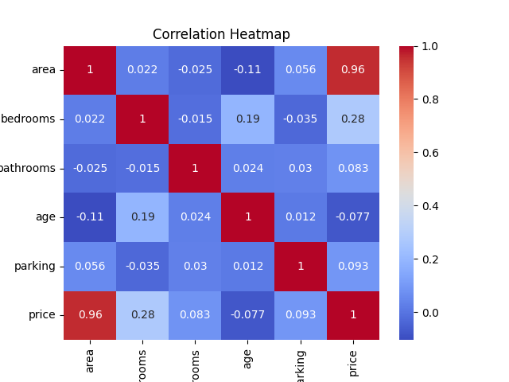
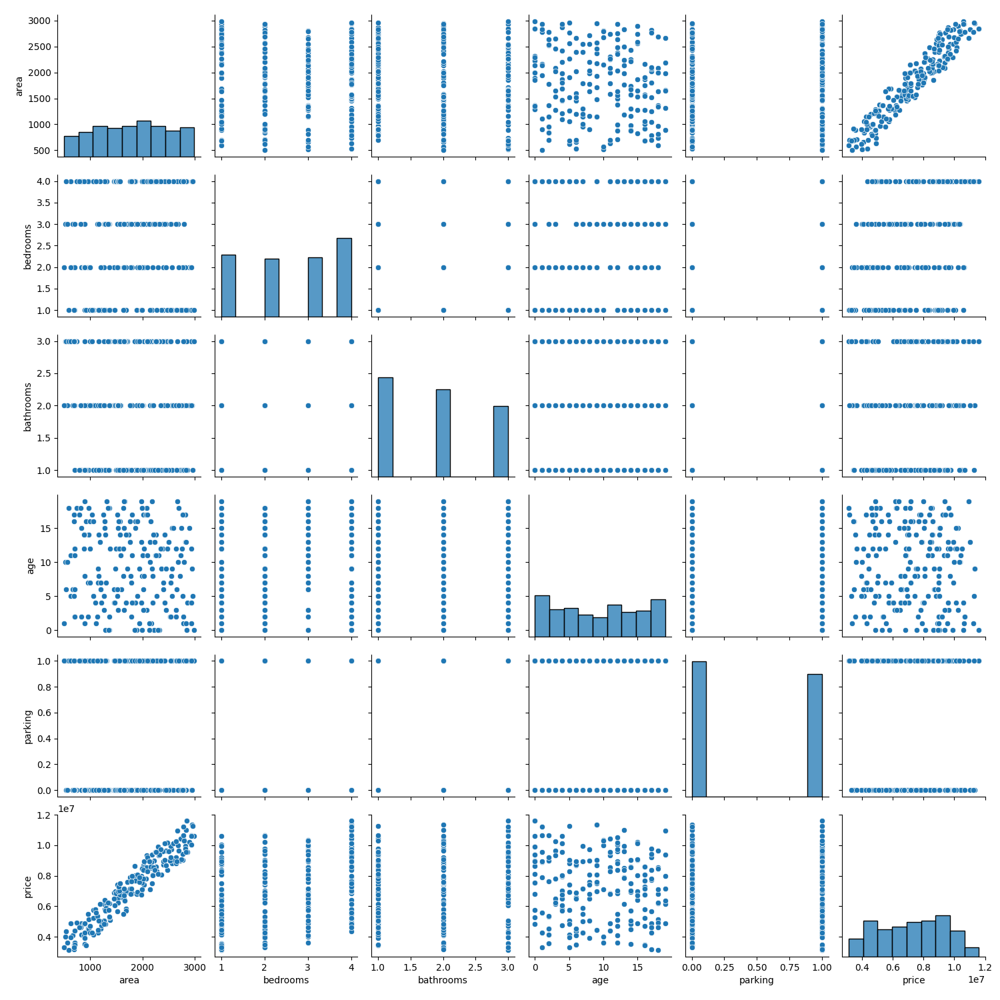
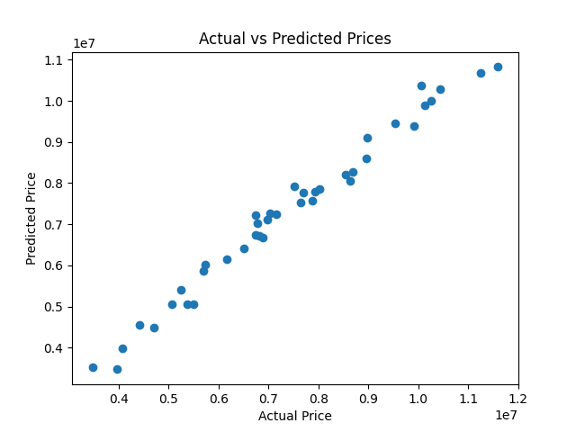

\# 🏠 House Price Prediction using Machine Learning


\## 📌 Project Overview


This project aims to predict house prices using Machine Learning regression models based on property features such as area, number of bedrooms, bathrooms, age of the property, and parking availability.


The goal is to build a data-driven system that helps estimate property prices accurately and efficiently.


\---


\## 🎯 Problem Statement


House prices vary due to multiple factors, making manual estimation difficult and inconsistent. This project uses machine learning algorithms to analyze historical housing data and predict prices for new properties.


\---


\## 🌍 Industry Relevance


This system is widely used in:


\* Real Estate Platforms (property valuation)

\* Banks (loan approval \& risk assessment)

\* Property Investors (investment decisions)

\* Brokers (pricing strategies)


\---


\## 🛠️ Tech Stack


\* Python

\* Pandas

\* NumPy

\* Matplotlib

\* Seaborn

\* Scikit-learn

\* Joblib


\---


\## 📊 Dataset


A synthetic housing dataset is generated using Python, simulating real-world housing features:


\* Area (sq ft)

\* Bedrooms

\* Bathrooms

\* Age of property

\* Parking availability


\---


\## ⚙️ Machine Learning Models Used


\* Linear Regression

\* Random Forest Regressor


\---


\## 📈 Model Evaluation Metrics


\* MAE (Mean Absolute Error)

\* RMSE (Root Mean Squared Error)

\* R² Score


\---


\## 🚀 Features


\* Data generation (synthetic dataset)

\* Data visualization (pairplot, heatmap)

\* Model training \& comparison

\* Price prediction for new input

\* Graphical analysis of results


\---

\### 🔹 Dataset Preview







\---


\## ▶️ How to Run


```bash

\# Clone repository

git clone https://github.com/<your-username>/House-Price-Prediction-ML.git


\# Navigate to folder

cd House-Price-Prediction-ML


\# Create virtual environment

python -m venv venv


\# Activate environment

venv\\Scripts\\activate


\# Install dependencies

pip install -r requirements.txt


\# Run project

python main.py

```


\---


\## 📂 Project Structure


```

House-Price-Prediction/

│

├── data/

├── notebooks/

├── src/

├── models/

├── outputs/

├── images/

├── main.py

├── requirements.txt

└── README.md

```


\---


\## 📊 Sample Output


```

Random Forest Metrics:

MAE: XXXXX

RMSE: XXXXX

R2 Score: XXXXX


Predicted Price: XXXXX

```


\---


\## 🎓 Learning Outcomes


\* Understanding regression models

\* Data preprocessing and visualization

\* Model evaluation techniques

\* Real-world ML project structuring

\* GitHub project management


\---


\## 🚀 Future Improvements


\* Use real-world housing dataset

\* Add location-based pricing

\* Deploy using Streamlit or Flask

\* Hyperparameter tuning


\---


\## 🤝 Contribution


Feel free to fork this repository and improve the project.


\---


\## ⭐ Acknowledgment


This project was built as part of a Machine Learning learning journey and portfolio development.


\---


